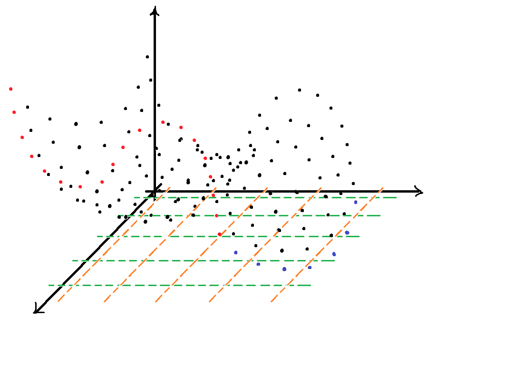
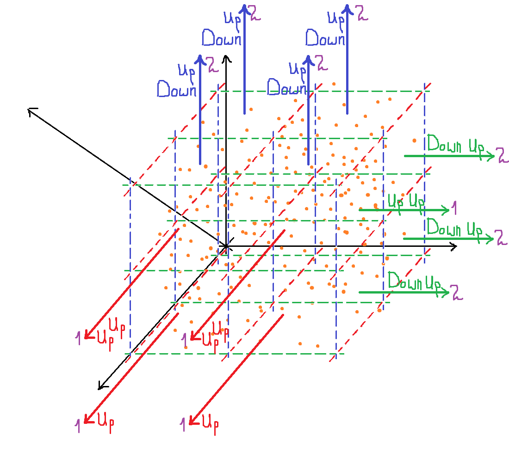

# Lazy Polynomial Regression

This project highlights how you can boost your Linear Regression model
for polynomial distributed data using fancy algorithm for finding power of data distribution. 

# Startup 🚀 

1. Create a directory `mkdir directory`
2. Clone this repo into the directory `git clone https://github.com/yehorkhod/lazy-polynomial-regression-research.git directory`
3. Go into the directory `cd directory`
4. Create a virtual environment `python -m venv venv`
5. Activate it: 
   - Windows:`.\venv\Scripts\activate`
   - Mac: `source venv/bin/activate`
6. Install the required dependencies `pip install -r requirements.txt`
7. Install ipykernel library `pip install ipykernel`
8. Create kernel `python -m ipykernel install --name=kernelname`
9. Don't forget to change kernel in notebook!

P.S. I hope python and jupyter is already installed!

# The Idea 💡🔗

## 2D case

### Second degree polynomial distributed data

Suppose, you've got a dataset and plot looks like that: 

If we applied Linear Regression it would cause underfitting and poor performance on the data: 

So here comes a Clever Polynomial Regression algorithm:

1. It finds minimum and maximum on x-axis:

    

2. It splits the data on half:

    

3. It finds maximum and minimum values on both halves:

    

4. Then, it looks at each half individually and labels it.

    Labeling:

        1. If minimum comes before maximum, it labels this half as "up".

        2. If maximum comes before minimum, it labels this half as "down".
       
    We can notice than minimum comes before maximum, so we can label this half as "up". 
       
    Then, we look at the second half.
    Here, on the contrary, minimum goes after maximum, so we label it "down".

    We are left with a list of "ups" and "downs" which looks like: ["up", "down"].
    So we can make a conclusion that the degree of data distribution is 2.

5. Now, when we know data distribution degree, we can apply second degree polynomial regression.

    

### Third degree polynomial distributed data

So, here is another dataset whose plot looks like this: 

Applying Linear Regression, as in previous example, would cause underfitting and poor performance on the data: 

Let's try Clever Polynomial Regression:

1. It finds minimum and maximum on x-axis:

    

2. Here comes a divisions parameter:

    1. We can split the data 1 time (divisions = 1):

        

        1. Algorithm finds minimums and maximums on each half:

            

        2. It labels each half as "up" and makes a conclusion that graph has 1 degree distribution.

        3. Aplying 1 degree is the same as aplying regular linear regression:

            

    2. We can split the data 2 times (divisions = 2):

        

        1. Algorithm finds minimums and maximums on each quarter:

            

        2. It labels 1 quarter as "up", 2 as "down", 3 as "down", 4 as "up".
            The conclusion which algorithm makes is that distribution degree is 3.

        3. Aplying 3 degree polynomial regression we get the result:

            

## 3D case

Let's have a look on 3D example:

Algorithm is roughly the same:

1. It splits the data:

    

2. It finds the maximum and minimum values in each segment (Arrows on the image show the direction from maximum to minimum):

    

3. The algorithm decides whether the graph is rising or falling for each row, relative to each axis.
    It creates two separate lists of labels.

    

4. Based on each list, the algorithm decides on the power of each row, relative to each axis.

    

5. Then, using some power decision criteria, it decides on the overall power for each axis.
    In this case, the power will be 2 for first axis and 3 for the other axis, using the most appearing power criteria.

6. Now we can apply polynomial regression with a different distribution degree for each axis.

## 4D case

What if we were given a 3 feature 1 target dataset?

 

Algorithm:

1. It splits the data:

    

2. The algorithm finds the maximum and minimum in each segment.

3. It determines whether the graph is rising or falling for each row, relative to each axis.
    It creates three separate lists of labels.

    

4. Based on each list, the algorithm determines the power of each row, relative to each axis.

    

5. Then, using some power decision criteria, it determines the overall power for each axis.
    In this case, using the most appearing power criteria, the power will be 1 for first axis, 2 for second axes, and 2 for third axes.

6. Now we can apply polynomial regression with a different distribution degree for each axis.

# Who, When, Why?
💻 Author: Yehor Khodysko  
📅 Version: 1.0  
📜 License: This project is licensed under the MIT License  
